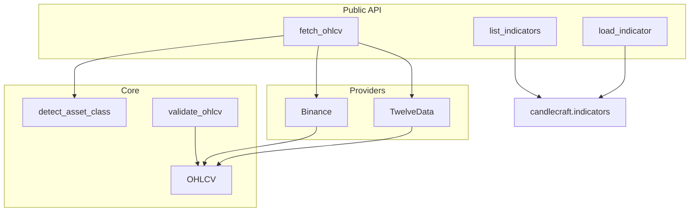

# Candlecraft Architecture

Candlecraft is a unified market-data library: one `fetch_ohlcv()` entry point for crypto, forex, and equities, with pluggable providers and packaged technical indicators.

## Design goal

Replace asset-specific scripts with a single OHLCV model and provider abstraction so downstream systems (backtests, dashboards, trading bots) consume one interface.

## Layer diagram



## Components

| Module | Responsibility |
|--------|----------------|
| `candlecraft/api.py` | Public API: `fetch_ohlcv`, provider selection, indicator loading |
| `candlecraft/models.py` | `OHLCV` dataclass, `AssetClass`, `Provider`, `RateLimitException` |
| `candlecraft/utils.py` | Symbol detection, validation, timezone helpers |
| `candlecraft/providers.py` | Binance and Twelve Data fetch implementations |
| `candlecraft/indicators/` | Technical indicators (`calculate(ohlcv_data) -> list[dict]`) |
| `pull_ohlcv.py` | CLI for fetch, stream, and display (uses library) |

## Data flow

1. Caller passes `symbol`, `timeframe`, and optional `limit` or `start`/`end`.
2. `detect_asset_class(symbol)` infers crypto vs forex vs equity.
3. Default provider is chosen: Binance for crypto (if installed), Twelve Data for forex/equity.
4. Provider returns raw API data → normalized `OHLCV` objects.
5. `validate_ohlcv()` enforces price invariants before returning.

## OHLCV model

`OHLCV` is a dataclass (not a dict) so consumers get:

- Type-safe fields (`timestamp`, `open`, `high`, `low`, `close`, `volume`)
- Consistent metadata (`symbol`, `timeframe`, `asset_class`, `source`)
- Validation at ingestion time

## Rate limiting

Twelve Data supports two strategies via `rate_limit_strategy`:

| Strategy | Behavior | When to use |
|----------|----------|-------------|
| `raise` (default) | Raises `RateLimitException` with optional `retry_after` | Batch jobs, explicit retry logic |
| `sleep` | Waits and retries once | Interactive scripts, notebooks |

Binance public API rate limits are handled by the client; library logs warnings when truncating requests above 1000 candles.

## Indicator plugin pattern

Each indicator in `candlecraft/indicators/<name>.py` exports:

```python
def calculate(ohlcv_data: list[OHLCV], **kwargs) -> list[dict]:
    ...
```

Load at runtime:

```python
from candlecraft import load_indicator
rsi = load_indicator("rsi")
values = rsi(ohlcv_data, period=14)
```

Indicators are packaged with the library so `pip install candlecraft` includes them.

## Extension: adding a provider

1. Add `Provider` enum value in `models.py`.
2. Implement `authenticate_<provider>()` and `fetch_ohlcv_<provider>()` in `providers.py`.
3. Wire selection in `api.fetch_ohlcv()` and `is_provider_available()`.
4. Add unit tests with mocked HTTP responses.

## Production context

Candlecraft powers the data layer for [MarketMakingMegaMachine](https://github.com/alfredalpino/MarketMakingMegaMachine) — a Hyperliquid market-making platform used at 3poch Labs.

## Tradeoff (honest)

v0.1 shipped indicators outside the package for fast iteration. v0.2 moves them inside `candlecraft.indicators` so PyPI installs work correctly — the right long-term choice over repo-relative paths.
